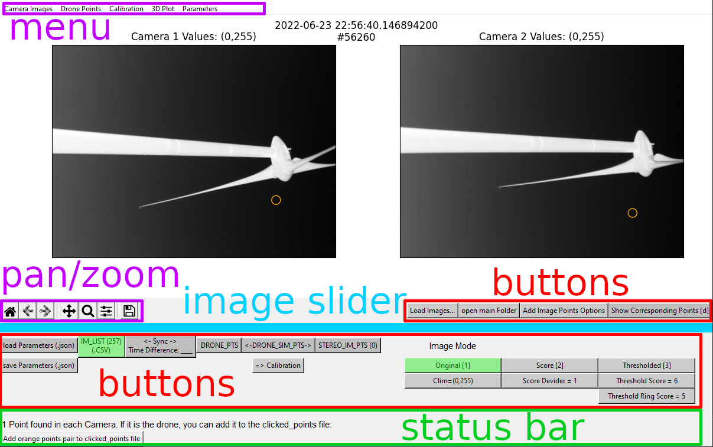
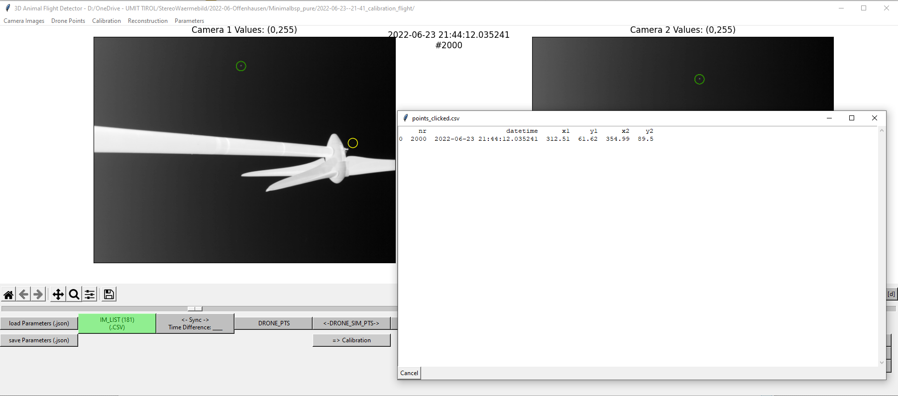
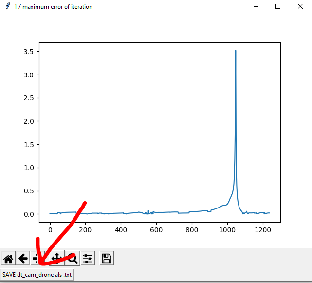
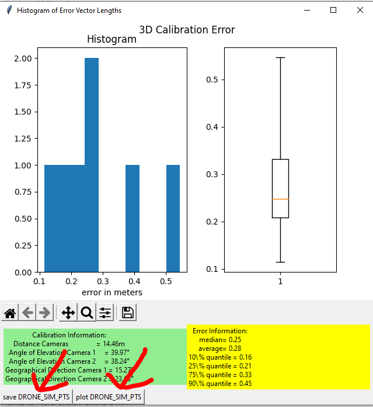
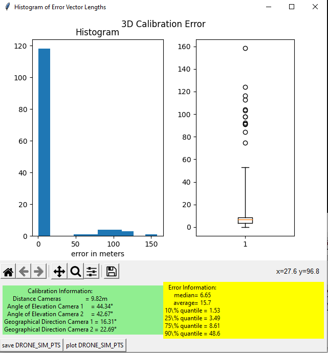
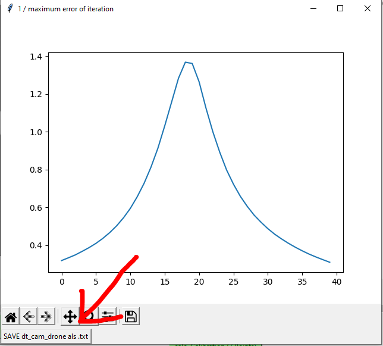

# Table of Contents
- [Download](#download)
- [Instructions](#instructions)
  - [Workflow A: Calibration of the Camera System](#workflow-a-calibration-of-the-camera-system)
- [Prerequisites Hardware](#prerequisites-hardware)

# Download
## Download Windows .exe
Download [batflight3d.exe v1.0](https://github.com/christofhapp/batflight3d/releases/download/v1.0/batflight3d.exe).

## Download minimal working example
The [minimal working example](https://github.com/christofhapp/batflight3d/releases/download/v1.0/minimal_working_example.zip) contains data to try the software with a working data set. It is used in the instructions and helps to get used to the software before generating your own data.

# Instructions
The software is GUI based and looks like this:



## Workflow A: Calibration of the Camera System
For the calibration of the camera system follow the steps in this section. All steps are based on a minimal example, but work the
same with your own data.

### Load images
- Load the images by clicking on the **Load Images...** button.
- Navigate to the folder **calibration flight** of the minimal example and choose the folders **cam1, cam2** and the **imagelist.csv**.
You should now be able to see the first imagepair. Below the images you can find some helpful tools including pan, zoom and reset.
Use the image slider to navigate through the images.
If you move the slider, yellow or orange circles may appear. These points are detected by 2D detection and may be the drone, flying animals or distortions.

### Load drone points
The DJI drone log file (containing the flightpath) is also located in the minimal examples **calibration flight** folder. We first need to
decode and save it:

- menu: **Drone Points &rarr; decode DJI .TXT and save as .CSV**
- Choose file **DJIFlightRecord 2022-06-23 [21-42-26].txt** and save it as **DRONE_PTS.csv** in the same folder.
- Open **DRONE_PTS.csv** by clicking on the button **DRONE_PTS**
The button turns green when the drone points are loaded. If you want to ook at the drone flightpath, you can 3D plot it:
- menu: **3D Plot &rarr; 3Dplot ALL drone points**

### Preliminary synchronization of the drone and camera signal
You now want to choose about 5 to 8 drone points for a preliminary synchronization. The drone points should not be very close together, so move the slider a good bit in order to get well distributed drone points. If you find a good image pair where you can identify the drone in the yellow circles:
- Double click it in both images and they turn green.
A window opens to show you how much points you have added already.



If there is just one orange circle per image and you are sure it is the drone:
- Hit the new button on the bottom **Add orange points pair to points_clicked.csv**

If you want to remove points: 
- Button **Add Image Points Options &rarr; delete point pair (double-click)**

You can also add points by saving the exact clicking position if they e.g. didn't get detected by the algorithm:
- Button **Add Image Points Options &rarr; add points by exact clicking position (double-click)**

All the points got saved automatically in your folder in a file named **points_clicked.csv**.
- Load the **points_clicked.csv** by clicking on the button **STEREO_SIM_PTS** and choose **points_clicked.csv**.

Now estimate a synchronization:
- menu: **Calibration &rarr; Calculate dt_cam_drone**

You get a graph. If it has a well defined peak, a good preliminary synchronization is achieved:
- Save the synchronization by clicking the button **SAVE dt_cam_drone as .txt**



### Preliminary calibration
Now that you have a synchronization, you can find the drone points corresponding to the image points. We do that for our clicked points:
- menu: **Calibration &rarr; Calculate DRONE_SIM_PTS**
The DRONE_SIM_PTS (drone stereo image points) button becomes green:
- Click on the **Calibration** button
A window opens showing the calibration errors and you can visually check the calibration by clicking on the **plot DRONE_SIM_PTS** button. If the calibration looks good enough, save the calibration by the **save DRONE_SIM_PTS** button.

<details>
<summary>Click here for an explanation of the DRONE_SIM_PTS</summary>
The DRONE_SIM_PTS (drone stereo image points) are the basis for the calibration. Every row contains the 2D coordinates of the drone in both images and the corresponding 3D drone GPS points. So if they are safed, the exact same calibration can be reproduced by just loading them and again click on the **Calibration** button.
</details>



### Automatic detection of all images points
Now you can automatically detect all possible image points.
- menu: **Camera Images &rarr; Loop over Images and detect Points for each Camera
- Choose filenames (one for each camera) and wait for it to finish.
You see the progress in the status bar.

Now you need to calculate the STEREO_IM_PTS from the the single camera image point files:
- menu: **Calibration &rarr; Calculate STEREO_IM_PTS**
- Choose a filname and wait for it to finish.
- Load the resulting file by clicking on the button **STEREO_IM_PTS**.
Calcualte the new DRONE_SIM_PTS from the STEREO_IM_PTS:
-  menu: **Calibration &rarr; Calculate DRONE_SIM_PTS**
Because you have a preliminary calibration already, it asks you if you want to use that calibration to decide if an image point is a drone point or if it is to far away and may be something else.
- Click **Ok**, 15 meters is good for now.

<details>
<summary>Click here for an explanation</summary>
You can see that some STEREO_IM_PTS did not become DRONE_IM_PTS, probably because the turbine or a bird got detected. That is fine. 
If we calcualte the DRONE_SIM_PTS again and choose x=0 we do not use the existing calibration and simply use all image points we found and correlate it to a drone point, even if the 3D image point is far away from the actual drone gps point based on the current calibration. It may look like that:
<br>

<br>
In this case you see that most errors are between 0 and 20 meters. A few values are above 60 meters of error, so it would make sense to choose a new x of maybe 50 meters for a new calculation of the DRONE_SIM_PTS.
</details>

### Use image points to refine synchronization
Now that you have much more DRONE_SIM_PTS, you can refine your synchronization:
-  menu: **Calibration &rarr; Calculate dt_cam_drone**
Because now you have > 10 DRONE_SIM_PTS, it locally shifts the drone and camera signal. The resulting curve may look like that:



The result is a better synchronization. Save the new dt_cam_drone:
- Click on the button **SAVE dt_cam_drone as .txt** and overwrite the old file (or choose a new name).

Now recalculate the DRONE_IM_PTS with your new dt_cam_drone:
-  menu: **Calibration &rarr; Calculate DRONE_SIM_PTS**

Now that you have your updated DRONE_SIM_PTS, you can also recalculate your DRONE_SIM_PTS
- Click on the button **Calibration**
- If you are happy with the result, save the **DRONE_SIM_PTS** as a calibration basis for the detection of bats in the next workflow.

## Workflow B: Detecting bats
This workflow is easier, because we did everything already


## Prerequisites Hardware
For the 3D reconstruction of flying animals with 3D Animal Flight Detector time synchronized images of two cameras are needed
as well as a drone flight log of a flight in front of the cameras. The points of the drone flight should be as evenly distributed in the sensed volume as possible.

### Cameras
The two Cameras have to be time synchronized and each image pair needs one timestamp. Place the images of the fi rst camera
in a folder and name the images alphanumerically (1.png, 2.png, ...). Do the same for the second camera with the same amount
of images and the same names. Also place an imagelist.csv with the timestamps at which each imagepair was taken:

```bash
project
├── cam1
│   ├── 1.png
│   ├── 3.png
│   ├── 5.png
│
├── cam2
│   ├── 1.png
│   ├── 3.png
│   ├── 5.png
│
├── imagelist.csv
```

imagelist.csv
```
nr,datetime
1, 2022-06-23 21:41:58.701641
3, 2022-06-23 21:42:02.034981
5, 2022-06-23 21:42:05.368321
```

### Drone Log File
A drone log file is needed with a timestamp, the latitudes and longitudes in the decimal form and the height above ground in
meters:

DRONE_PTS.csv
```
datetime,lat,lon,height
2022-06-23 19:42:26.386,49.42217084716835,11.447858470221677,0.0
2022-06-23 19:42:26.486,49.42217088440474,11.447858501829796,0.0
2022-06-23 19:42:26.586,49.42217094773711,11.447858540094895,0.0
```
